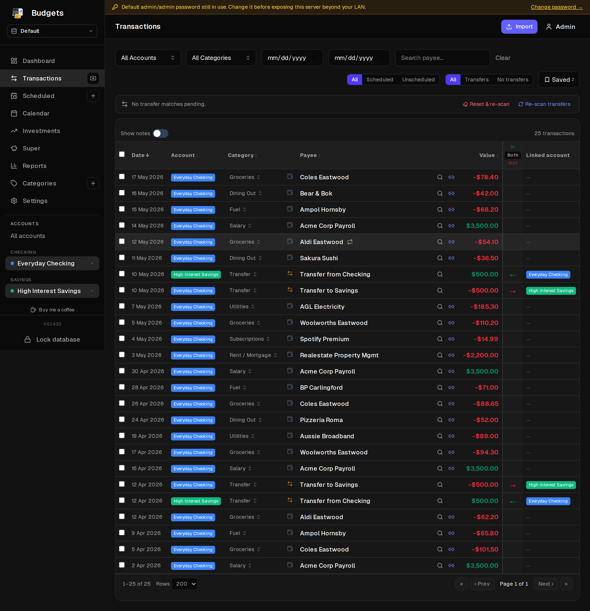
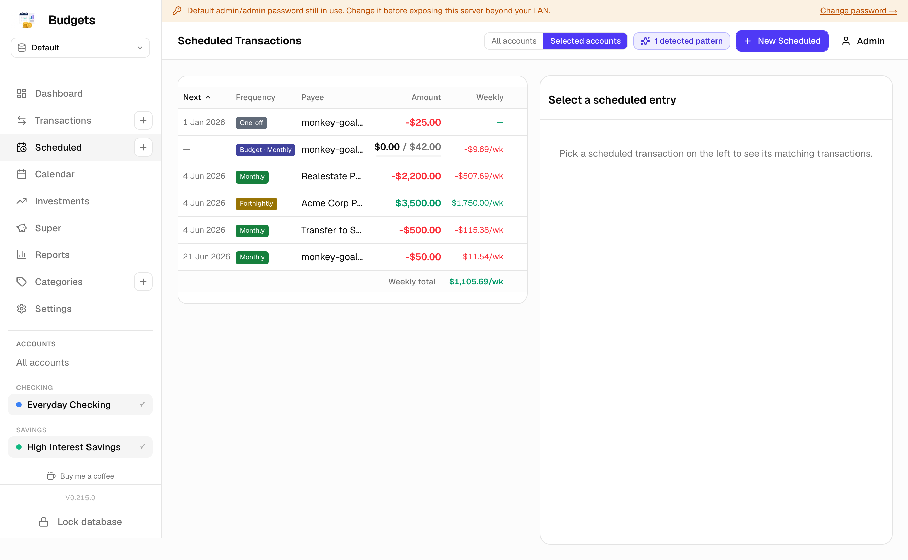

# Budgets

A self-hosted household finance tracker. Imports bank exports,
categorises transactions, projects cashflow, and tracks recurring
schedules and per-period spending budgets.

Built for AUD, single-household, LAN-accessible from desktop and
mobile. Data lives in a single SQLCipher-encrypted SQLite file — no
external services, nothing leaves the box.

## Screenshots

| Transactions (dark) | Scheduled (light) |
|---|---|
|  |  |

## Stack

- **Next.js 16** (App Router, server components, route handlers)
- **SQLite** via `@signalapp/better-sqlite3` (Signal's SQLCipher fork)
  + **Drizzle ORM** (hand-written SQL migrations in `drizzle/`)
- **NextAuth** for session auth
- **SWR** for client data fetching
- **shadcn/ui** on top of `@base-ui/react` (not Radix)
- **Recharts** for cashflow / occurrence / Sankey charts
- **Tailwind v4**
- **Vitest** for unit + benchmark coverage

## Features

- **Encrypted at rest** — the live DB file is SQLCipher-encrypted
  (AES-256, 4096-byte pages). Boots in *locked* mode: no DB
  connection until someone supplies the passphrase via `/unlock`
  (web flow) or the `SQLITE_KEY` env var (containers). A *Lock now*
  button in the sidebar drops the in-memory key on demand and
  bounces every device on the LAN to `/unlock`.
- **Passphrase rotation** — `/rekey` changes the key in place. The
  file is re-encrypted under the new passphrase; existing sessions
  stay open.
- **Accounts** — checking / savings / credit / loan / cash, with
  starting balance, reconciliation checkpoints, per-account
  *external* flag for savings/emergency buckets that opt out of
  internal-pool netting.
- **Transactions** — paginated list with running-balance column on
  single-account views, transfer pair detection + manual link/unlink,
  reconciled lock indicator, notes, bulk category apply, row-expand
  metadata panel, searchable comboboxes.
- **Import** — drag-drop CSV / OFX / QFX / QIF in a dedicated view.
  Cross-format dedup migrates legacy hashes forward and backfills
  type / balance / category / posted_seq onto matched rows rather
  than re-inserting duplicates. First-format guard, identical-row
  hiding, per-row balance reconciliation against the bank's claimed
  running balance.
- **Categories** — three-level hierarchy. Categorisation runs through
  payee rules (explicit overrides) then a trigram-similarity suggester
  trained on your own history; the inline picker only writes a rule
  when the user genuinely overrides the suggester so the rules table
  stays small.
- **Scheduled transactions** — recurring expense / income / transfer
  schedules, range-amount mode for variable bills, lineage chains so
  a renamed/repriced schedule keeps its history, forecasts, missed-
  occurrence detection.
- **Budgets** — period spending caps (weekly / monthly / quarterly /
  yearly) aggregated across a category subtree. Stored on the same
  `scheduled_transactions` table with `kind = 'budget'`. Account
  scope optional; refunds reduce spent (not inflate it). Chart
  colours each past period, matched-list groups txns per period.
- **Calendar** — month / week toggle with cashflow projections,
  today and projected-balance markers, persistent view preference.
- **Cashflow** — projects future balances forward by expanding active
  schedules; treats asset-to-liability transfers (loan repayments) as
  real cashflow, asset-to-asset as internal netting.
- **Reports** — cashflow, monthly, by-category (income / expense),
  envelope, Sankey, and tax-deductions windows over arbitrary date
  ranges.
- **Investments + watchlist + superannuation** — paper trades,
  watchlist, super-fund snapshots with self/spouse labelling.
- **Backups** — Sonarr/Radarr-style: a Backups card on Settings
  lists prior `.sqlite` snapshots with per-row Download / Restore /
  Delete and a *Backup now* button. Snapshots are produced via
  `VACUUM INTO`, so each file is itself SQLCipher-encrypted with
  whatever key was active when it was taken. Restore takes a
  pre-restore snapshot first, swaps the file, then bounces to
  `/unlock`. Optional scheduler with retention. The card also
  shows free-space available on the volume.

## Stats

Snapshot as at 2026-05-08.

**Timeline**

- First commit: 2026-04-29 — *Initial Next.js 15 project bootstrap*
- 11-day span, 173 commits, 1 contributor
- Daily commit cadence: 20 / 4 / 1 / 1 / 20 / 49 / 54 / 24 across
  Apr 29 → May 8 — heavy weekend bursts, then sustained iteration

**Code**

- 204 TS / TSX files in `src/` (~38.0k LOC)
- Composition: 111 `.ts`, 93 `.tsx`, 3 `.sql` migrations on top of
  the SQLite baseline, plus config / docs / assets
- 17 app pages, 61 API route handlers, 72 React components
- 19 DB tables on the SQLite baseline
- 39 pnpm dependencies (24 runtime + 15 dev)

**Testing**

- 12 test + bench files under `src/**/*.test.ts` / `*.bench.ts`
- 118 test cases covering domain logic — categorisation, recurrence,
  budget periods, cashflow back-compute, transfer matching, payee
  rules, disk-usage caching, category descendants
- One vitest bench for the category-descendants walk used by
  `/api/scheduled/budget-progress`

**Activity**

- +69,942 / −14,791 lines across history (net ~+55.2k)
- ~404 insertions per commit average
- Most-churned files: `scheduled-list-view`, `schema.ts`,
  `category-manager`, `categorize` lib, `transactions` route,
  `cashflow-calendar`, the sidebar, `transactions-view`,
  `reports-view`, `investments-view`

## Running locally

The data store is a single SQLite file encrypted with SQLCipher. The
passphrase lives in `SQLITE_KEY` (or is entered via `/unlock`) and
**must never be lost** — no key, no data. Save it in your password
manager before doing anything else.

```bash
# 1. Generate a passphrase and write the file path into .env.local
echo "SQLITE_PATH=./data/budget.db"          >> .env.local
echo "SQLITE_KEY=$(openssl rand -hex 32)"    >> .env.local
# (also copy the AUTH_SECRET / NEXTAUTH_SECRET lines from .env.example)

# 2. Apply the schema to a fresh DB
corepack enable      # pins pnpm via the package.json packageManager field
pnpm install
pnpm db:migrate

# 3. Run the app
pnpm dev         # http://0.0.0.0:3002
```

Migrations also self-apply on the first successful `/unlock` after
shipping a new schema, so HMR-shipped changes don't need a manual
`db:migrate`.

The dev server listens on `0.0.0.0` so other devices on the LAN can
hit it directly.

## Publishing the container

Production runs from a container image pulled by the cluster. The
build/push happens on any docker- or podman-capable workstation (or
a CI runner) — the dev host doesn't need a runtime installed.

```bash
# 1. Login once on the host doing the publish
docker login docker.io                       # Docker Hub
# or:  docker login ghcr.io                  # GitHub Container Registry
# or:  docker login registry.example.lan     # private registry

# 2. From a clean working tree, build + tag (× 3) + push
DOCKER_REGISTRY=docker.io/<your-username> pnpm docker:release
```

`DOCKER_REGISTRY` is required and tells the script where to push.
`DOCKER_IMAGE` (default `budgets`) sets the image name within that
namespace. The runtime is auto-detected — `docker` first, then
`podman`; force one with `CONTAINER_RUNTIME=podman`.

The release script tags every push three ways, all pointing at the
same digest:

| Tag | Use |
|---|---|
| `<registry>/<image>:<git-short-sha>` | Immutable per commit — pin cluster manifests to this |
| `<registry>/<image>:<semver>` | Human-friendly handle (from `package.json` `version`) |
| `<registry>/<image>:latest` | Convenience pointer; overwritten on every push |

The script refuses to release on a dirty tree so the SHA tag never
points at something a fresh clone can't reproduce. Pass
`--allow-dirty` if you really mean it, or `--dry-run` to preview the
commands without invoking the runtime.

Run-time env vars the cluster supplies:

| Var | Purpose |
|---|---|
| `AUTH_SECRET` | NextAuth session secret. **Required.** Signs the session JWT; without it login fails. |
| `NEXTAUTH_SECRET` | Alias of `AUTH_SECRET`. NextAuth reads either; setting both keeps next-auth v4-shaped clients happy. |
| `NEXTAUTH_URL` | Public URL the cluster serves on (e.g. `https://budgets.lan`). Default `http://localhost:3000`. |
| `SQLITE_KEY` | SQLCipher passphrase. **Optional** — see below. Set to auto-unlock at boot; omit to require web-unlock via `/unlock`. |
| `SQLITE_PATH` | Path to the `.db` file inside the container. Default `/data/budget.db`. |

### Generating secrets

Both `AUTH_SECRET` and the `SQLITE_KEY` (when you choose to set one)
should be ≥32 bytes of cryptographically random hex or base64. Pick
one of:

```bash
openssl rand -hex 32          # 64-char hex — what we use in dev
openssl rand -base64 32       # 44-char base64, NextAuth's docs default
node -e 'console.log(require("crypto").randomBytes(32).toString("hex"))'
```

Generate fresh values per environment; never reuse a `SQLITE_KEY`
across DBs or commit either to git. Stash both in a password
manager / secret store — losing `SQLITE_KEY` is data loss (the
encrypted DB file cannot be opened without it), and rotating
`AUTH_SECRET` invalidates everyone's sessions.

### First-run / no-passphrase-yet workflow

The app can boot with `SQLITE_KEY` unset. It comes up locked, and the
proxy redirects every request to `/unlock` until a key is supplied
via the web form. The page detects an empty `/data` and switches
its copy to "Create your database" — the passphrase you type creates
`/data/budget.db`, keys it, and applies migrations. A brand-new
deploy initialises entirely from the browser without ever putting
the key in the container env.

Subsequent restarts then need the same passphrase. Either re-enter
it via `/unlock` each time, or once you've decided on a key, set
`SQLITE_KEY` so the container auto-unlocks on boot.

### Volume permissions

The image runs as `nextjs` (uid 1001). The mounted volume at `/data`
**must be writable by uid 1001** or the first /unlock POST returns
`Permission denied accessing /data/budget.db. The data directory
must be writable by uid 1001 …`.

| Runtime | Fix |
|---|---|
| Kubernetes | Set `spec.securityContext.fsGroup: 1001` on the pod — the kubelet chowns the volume on mount. |
| docker compose / podman compose | The named volume is created by the runtime as root by default; either pre-create it `chown -R 1001:1001 <hostpath>` or run an init container, OR switch the volume to a host bind that's already 1001-owned. |
| Plain `docker run -v /host/path:/data` | `chown -R 1001:1001 /host/path` once on the host. |

The image's built-in HEALTHCHECK probes `/api/unlock`, which works
even when /data is unwritable (the route stays reachable; the error
surfaces only when someone POSTs a passphrase). Treat the first
unlock attempt as the real readiness check.

## Database migrations

Drizzle SQL files live in `drizzle/`. The legacy chain was collapsed
into a single SQLite baseline (`0000_narrow_black_panther.sql`)
during the Postgres → SQLite migration; new migrations stack on top
of it. Schema source of truth: `src/db/schema.ts`.

```bash
# Apply pending migrations against the SQLite file at SQLITE_PATH
SQLITE_KEY=… pnpm db:migrate
```

The migration runner keys the connection before issuing any DDL, so
the file is encrypted from the very first page.

## Project layout

```
drizzle/                  Hand-written SQL migrations
src/
  app/                    Next.js App Router (route handlers + pages)
    (app)/                Authenticated UI routes
    api/                  Route handlers
    unlock/               Lock / unlock flow (no auth gate)
  components/             React components by feature
  db/                     Drizzle schema + connection (lock-aware proxy)
  lib/                    Domain helpers (cashflow, recurrence,
                          budget-period, category-descendants,
                          payee-rule decision, OFX/CSV/QIF parsers,
                          backup helpers, etc.)
  hooks/                  Client hooks (account filter,
                          lock-database, add-category, etc.)
public/
```

## Tests

```bash
pnpm test          # run once
pnpm test:watch    # vitest in watch mode
pnpm test:e2e      # Playwright (headless chromium against a separate dev server)
```

Tests live next to the code they cover (`src/**/*.test.ts`); the
benchmark suite is `src/**/*.bench.ts`. The harness has no DB
dependency — domain helpers are pure functions, and DB-coupled
helpers expose a structural seam (e.g. `descendantIdsFromMap`,
`decidePayeeRuleAction`) that lets tests run against fixture data
without spinning up SQLite.
