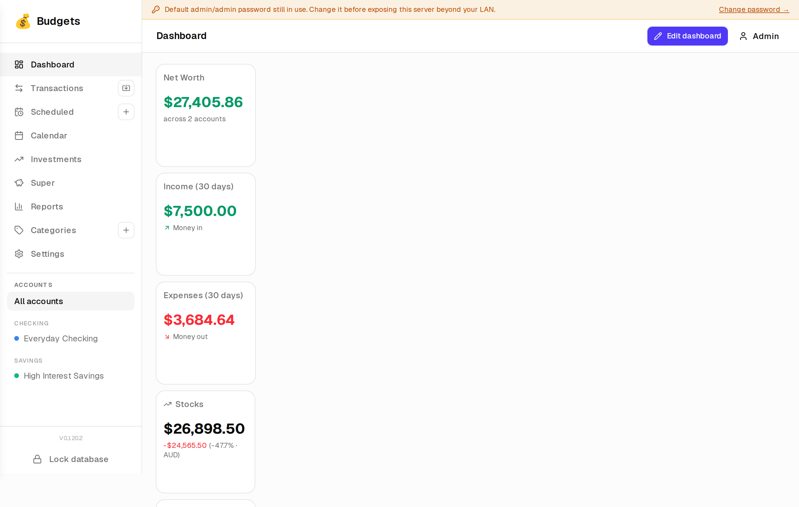
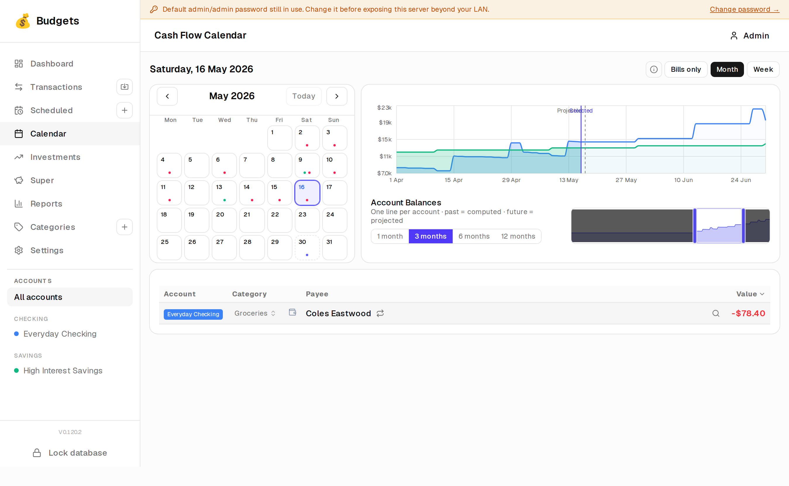
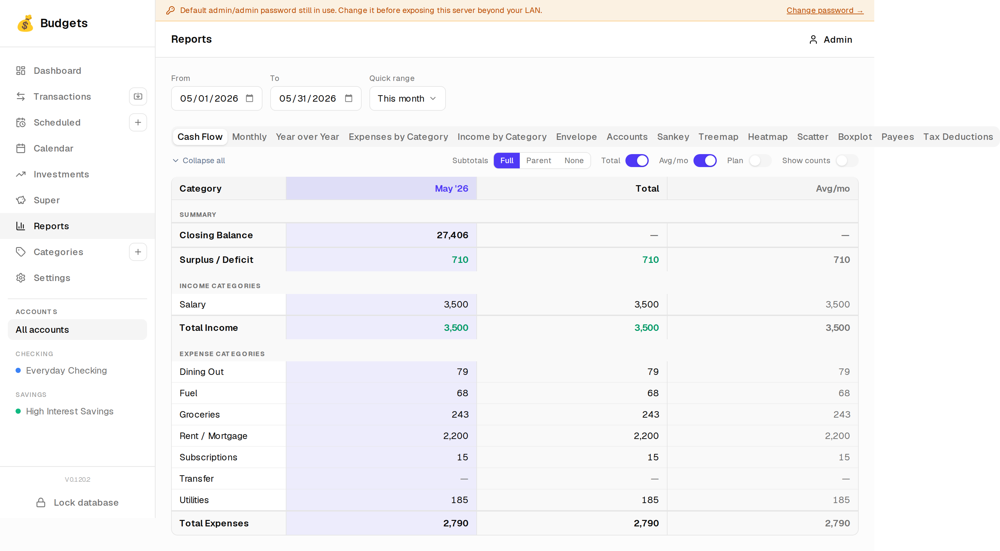
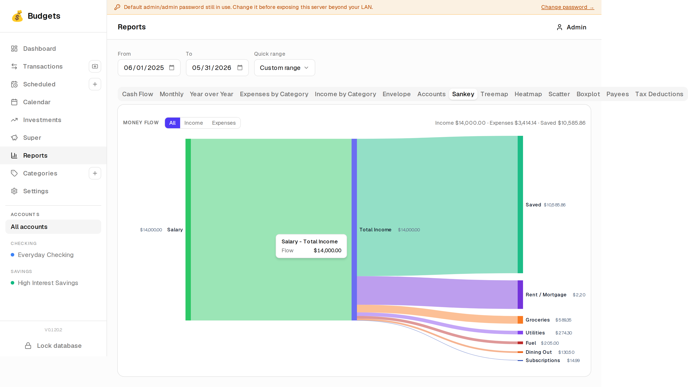
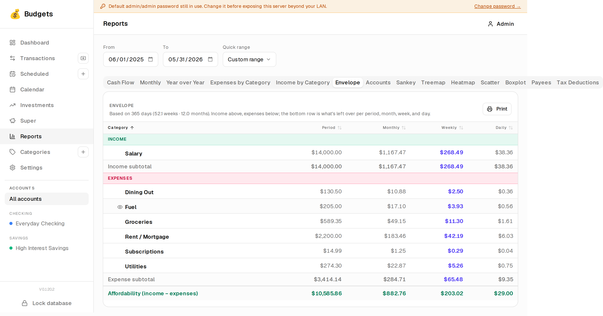
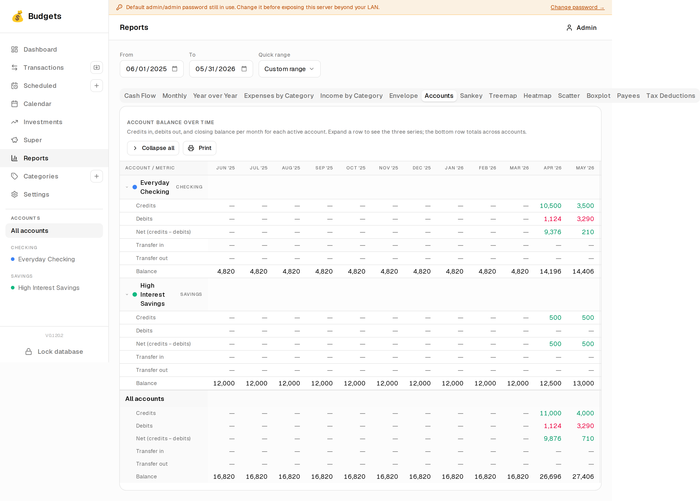
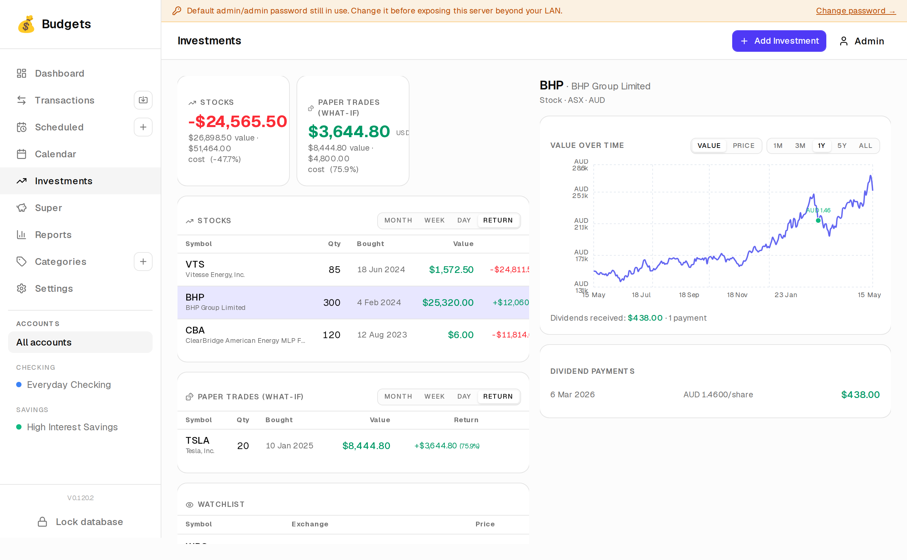
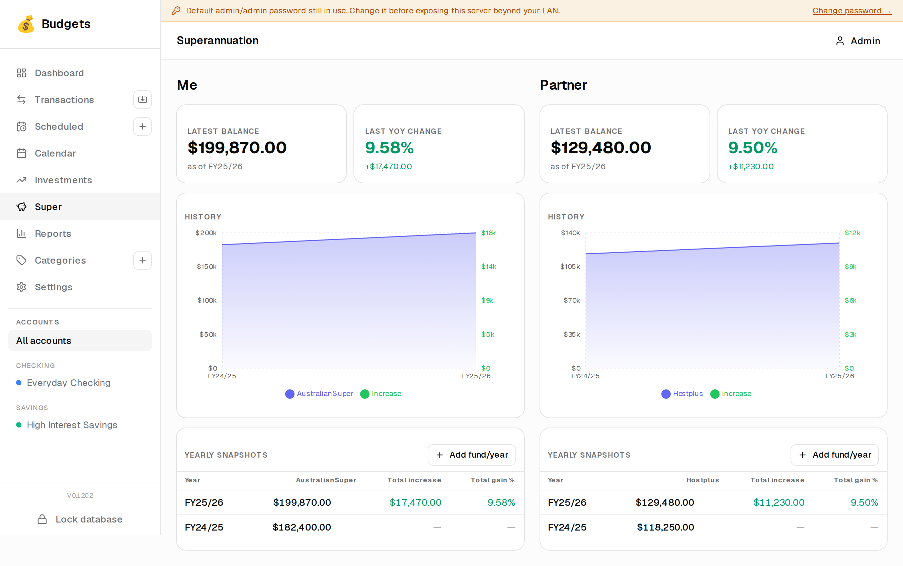

# Budgets

A self-hosted household finance app. Your data, your machine, no
third parties. Designed for one household, runs on a Raspberry Pi
or a home server, accessible from any device on your LAN —
desktop, phone, tablet.

Everything lives in a single encrypted file. Nothing leaves the
box.

## Screenshots

| Dashboard | Transactions |
|---|---|
|  |  |

| Scheduled & budgets | Calendar |
|---|---|
|  |  |

| Cashflow report | Sankey report |
|---|---|
|  |  |

| Envelope (income, expenses, affordability) | Accounts (per-account credits / debits / balance) |
|---|---|
|  |  |

| Investments | Superannuation |
|---|---|
|  |  |

## What it does

**Track money in and out.** Drag-and-drop your bank's CSV / OFX /
QIF / QFX export onto the import page. The app reads it, finds
duplicates against what you've already imported, lets you tweak
categories, and commits the rest in one click. Re-importing the
same statement is safe — already-seen rows update in place
instead of duplicating.

**Auto-categorise from your own history.** No central rule list
to maintain. Pick a category for a row once, and similar payees
get the same category next time — picked up from your own
transactions, not a generic merchant dictionary.

**Schedule everything that repeats.** Rent, salary, streaming
subscriptions, BAS instalments — anything that comes back on a
cadence (weekly, monthly, quarterly, yearly, or every-N-days).
The calendar projects them forward; the dashboard surfaces
what's due in the next 30 days.

**Budget per category, per period.** Set a cap on Groceries per
fortnight or Eating Out per month and watch progress in the
dashboard widget.

**See where money goes.** Cashflow chart, monthly breakdown,
category subtree drill-down, Sankey diagram of where dollars
flow, tax-deductions report for any date range.

**Track investments.** Stocks (real and paper-trade), watchlist
of tickers you're keeping an eye on, superannuation snapshots
(self + spouse), per-position day change and YoY return. Pin
any single position or category to the dashboard as a 2×2
widget — multiple instances allowed, so a row of Tracked-stocks
or Account-balance tiles is one drag-and-drop each.

**Customise your dashboard.** Edit mode (top-right of the
dashboard) opens a drawer; drag widgets onto a 12-column grid,
resize from the corner, save. The arrangement persists per
device-pair (browser fingerprint, basically).

**Snapshots before you do anything risky.** A Backups page in
Settings shows existing `.sqlite` snapshots with Restore /
Download / Delete buttons, and a "Backup now" affordance. The
restore flow auto-takes a fresh snapshot first, swaps the file,
and bounces you back to the unlock screen — recovery from a
botched import is one click.

**Encrypted on disk.** The data file is SQLCipher (AES-256). The
app boots locked: nothing reads or writes the database until
someone supplies the passphrase, either via the `/unlock` form
or an environment variable for headless boots. Lose the
passphrase, lose the data — there's no recovery. Stash it
in a password manager before you start.

## Installation

Two release artifacts, same app, different shapes:

- **Linux container** (primary) — multi-device on your LAN. Pull
  from GHCR, run with podman/docker, point a volume at a folder
  for the database.
- **Windows desktop** — single-user app for one Windows machine.
  Download the .exe from the [latest GitHub Release](https://github.com/budgets-au/budgets/releases/latest)
  and install. No server to manage.

### Linux container (LAN deployment)

```bash
# Pull the image
podman pull ghcr.io/budgets-au/budgets:latest

# Generate the two secrets — keep them somewhere safe
echo "AUTH_SECRET=$(openssl rand -hex 32)"  >  .env
echo "SQLITE_KEY=$(openssl rand -hex 32)"  >> .env

# Run it
podman run -d \
  --name budgets \
  --env-file .env \
  -v $HOME/budgets-data:/data \
  -p 3000:3000 \
  ghcr.io/budgets-au/budgets:latest

# Open http://localhost:3000 in a browser. Default login is
# admin / admin — change it in Settings → Users on first use.
```

Replace `podman` with `docker` if that's what you have. The
`$HOME/budgets-data` directory must be writable by uid 1001
(the container runs as a non-root user) — if you hit a
permission error on first unlock, `chown -R 1001:1001` it once.

For LAN access from other devices, bind to `0.0.0.0` (the default
inside the container) and reach it via `http://<server-ip>:3000`.
Set `NEXTAUTH_URL` to the URL you'll actually use (e.g.
`http://budgets.lan`) so the login redirects work.

### Windows desktop (single machine)

Grab `budgets-X.Y.Z-setup.exe` from the
[latest GitHub Release](https://github.com/budgets-au/budgets/releases/latest)
and run it. Click through the installer (you can change the
install dir). A shortcut lands on the Desktop and in the Start
menu.

On first launch the app opens a single window pointing at its
bundled web server. You'll see the unlock screen — type a
passphrase. The encrypted database file gets created at
`%APPDATA%\Budgets\data\budget.db`; the passphrase is yours to
keep (and lose at your own risk).

Migrating from an existing Linux deployment? Install the desktop
app, then **Settings → Backup → Restore** a `.sqlite` snapshot
from your container's `$HOME/budgets-data/backups/` folder. Same
encryption format, the app handles the swap.

The .exe is unsigned for now, so Windows SmartScreen warns on
first launch — click **More info → Run anyway**. (Will be signed
once we have a cert.)

## Updating

The sidebar shows a small **New release** link below the version
number when a newer release is available. Click it to read the
notes.

**Linux container:** re-pull and recreate.

```bash
podman pull ghcr.io/budgets-au/budgets:latest
podman rm -f budgets
# repeat the `podman run …` from above
```

Your `.env` and `$HOME/budgets-data` carry over.

**Windows desktop:** download the newer setup .exe from the
[latest Release](https://github.com/budgets-au/budgets/releases/latest)
and run it — it replaces the install in place. Your
`%APPDATA%\Budgets\data\budget.db` is untouched by the upgrade.

## Development

The source lives under [github.com/budgets-au/budgets](https://github.com/budgets-au/budgets).
See [`AGENTS.md`](AGENTS.md) and [`CLAUDE.md`](CLAUDE.md) for
contributor conventions; the rest is straightforward Next.js 16 +
Drizzle + Tailwind. `pnpm dev` runs locally on
`http://0.0.0.0:3002` after `pnpm install && pnpm db:migrate`.

## Disclaimer

This is a personal-use household tool, not a regulated financial
product. Numbers it reports are only as accurate as the data
you feed it. Reconcile against your bank statement before you
make decisions on it.
