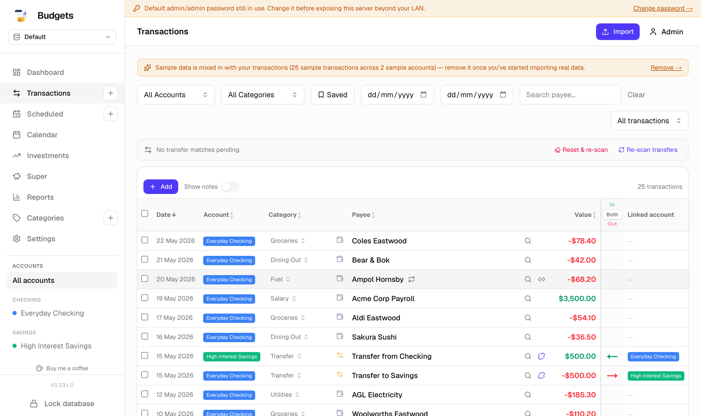
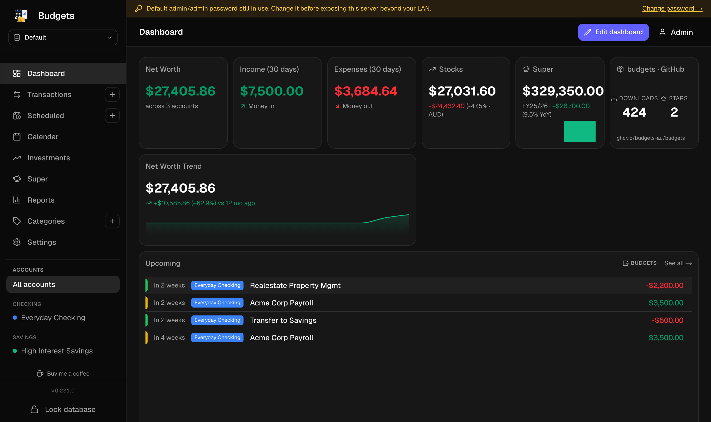
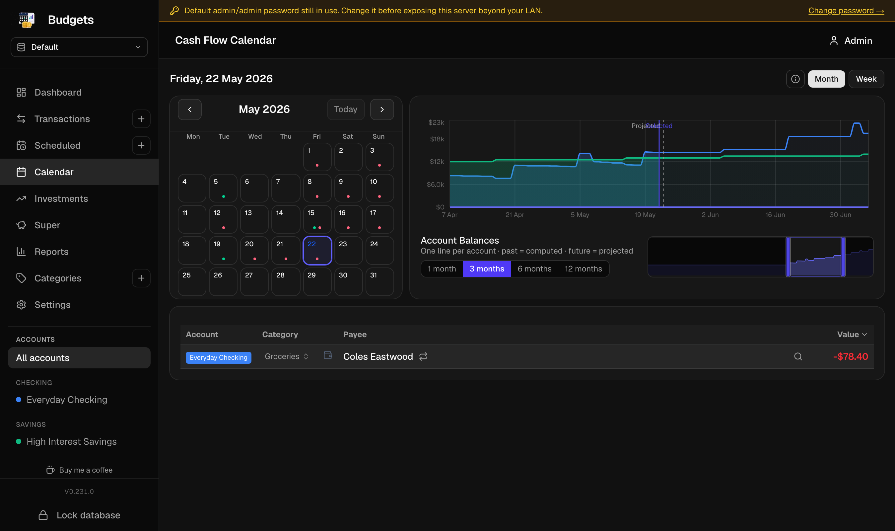
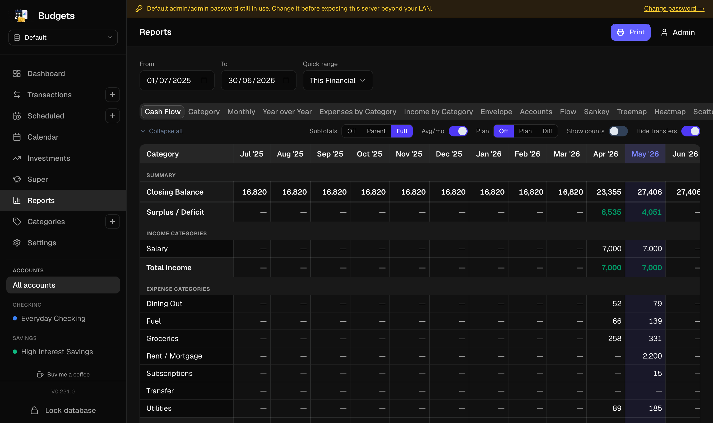
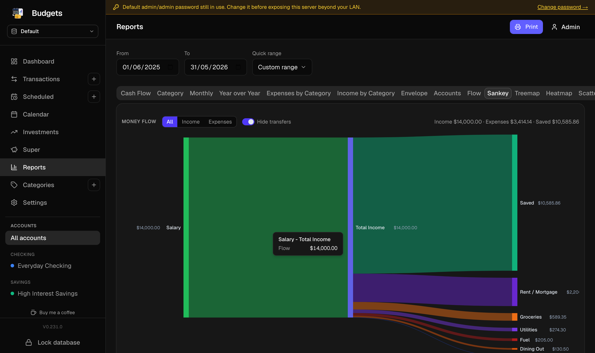
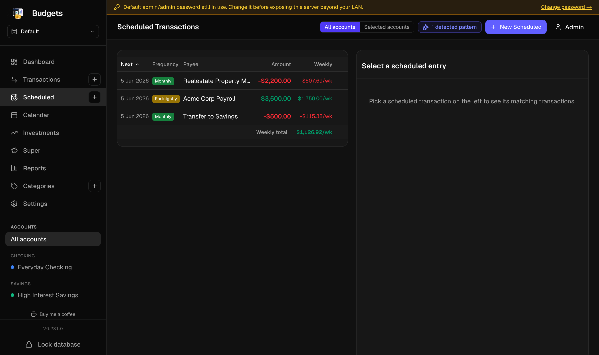

# Budgets

A self-hosted household finance app. Your data, your machine, no
third parties. Designed for one household, runs on a Raspberry Pi
or a home server, accessible from any device on your LAN —
desktop, phone, tablet.

Everything lives in a single encrypted file. Nothing leaves the
box.

## Screenshots

| Dashboard | Transactions | Calendar |
|---|---|---|
|  |  |  |
|  |  |  |

| Cashflow report | Sankey report | Scheduled & budgets |
|---|---|---|
|  |  |  |
|  |  |  |

## What it does

**Track money in and out.** Drag-and-drop your bank's CSV / OFX /
QIF / QFX export onto the import page. The app reads it, finds
duplicates against what you've already imported, lets you tweak
categories, and commits the rest in one click. Re-importing the
same statement is safe — already-seen rows update in place
instead of duplicating.

**Auto-categorise from your own history.** No central rule list
to maintain. Pick a category for a row once, and similar payees
get the same category next time — picked up from your own
transactions, not a generic merchant dictionary.

**Schedule everything that repeats.** Rent, salary, streaming
subscriptions, BAS instalments — anything that comes back on a
cadence (weekly, monthly, quarterly, yearly, or every-N-days).
The calendar projects them forward; the dashboard surfaces
what's due in the next 30 days.

**Budget per category, per period.** Set a cap on Groceries per
fortnight or Eating Out per month and watch progress in the
dashboard widget.

**See where money goes.** Fifteen built-in reports — pick the one
that answers the question you have:

| Report | What it shows |
|---|---|
| **Cash Flow** | Category × month matrix of income & expenses with per-row totals and rolling averages. The default landing tab. |
| **Category** | The same data rolled up to one row per category for the selected period, no monthly columns — for a one-screen "where did the money go this period". |
| **Monthly** | Income vs expenses bar chart per month over the period; quick visual on whether you're banking or burning. |
| **Year over Year** | Side-by-side category totals for the last 5 financial years, anchored to today's FY (ignores the page from/to). |
| **Expenses by Category** | Drill-down tree of expense categories with parent subtotals; click a row to expand its children. |
| **Income by Category** | Same drill-down shape, restricted to income categories. |
| **Envelope** | Weekly / per-month roll-up of top-level expense categories — frames spend as "how much you have left per week" rather than per-period totals. |
| **Accounts** | Per-account credit / debit / closing-balance by month — same column layout as Cash Flow but grouped by account. |
| **Flow** | Sankey of money moving *between accounts* (transfers). Root-account picker narrows the ribbons to flows through one chosen account. |
| **Sankey** | Income → hub → expenses money-flow visualisation, with a Saved / Savings node on whichever side balances the period. |
| **Treemap** | Category hierarchy at a glance — rectangles sized by absolute spend; click a sub-rectangle to drill in. |
| **Heatmap** | GitHub-contributions-style daily-spend grid; cell colour intensity tracks day-total absolute spend across the period. |
| **Scatter** | Every transaction as a dot (date × amount), colour by category, with a smoothing line on top — useful for spotting outliers. |
| **Payees** | Top-25 payees by absolute spend with a cumulative-% overlay; surfaces the 80 / 20. |
| **Tax Deductions** | Per-FY summary of deductible expenses + WFH hours; ignores the page from/to (owns its own FY scope). |

**Track investments.** Stocks (real and paper-trade), watchlist
of tickers you're keeping an eye on, superannuation snapshots
(self + spouse), per-position day change and YoY return. Pin
any single position or category to the dashboard as a 2×2
widget — multiple instances allowed, so a row of Tracked-stocks
or Account-balance tiles is one drag-and-drop each.

**Customise your dashboard.** Edit mode (top-right of the
dashboard) opens a drawer; drag widgets onto a 12-column grid,
resize from the corner, save. The arrangement persists per
device-pair (browser fingerprint, basically).

**Snapshots before you do anything risky.** A Backups page in
Settings shows existing `.sqlite` snapshots with Restore /
Download / Delete buttons, and a "Backup now" affordance. The
restore flow auto-takes a fresh snapshot first, swaps the file,
and bounces you back to the unlock screen — recovery from a
botched import is one click.

**Encrypted on disk.** The data file is SQLCipher (AES-256). The
app boots locked: nothing reads or writes the database until
someone supplies the passphrase, either via the `/unlock` form
or an environment variable for headless boots. Lose the
passphrase, lose the data — there's no recovery. Stash it
in a password manager before you start.

## Installation

A self-built container image on GHCR. Pull, run, supply two
secrets, point a volume at a folder for the database file. That's
it.

```bash
# Pull the image
podman pull ghcr.io/budgets-au/budgets:latest

# Generate the two secrets — keep them somewhere safe
echo "AUTH_SECRET=$(openssl rand -hex 32)"  >  .env
echo "SQLITE_KEY=$(openssl rand -hex 32)"  >> .env

# Run it
podman run -d \
  --name budgets \
  --env-file .env \
  -v $HOME/budgets-data:/data \
  -p 3000:3000 \
  ghcr.io/budgets-au/budgets:latest

# Open http://localhost:3000 in a browser. Default login is
# admin / admin — change it in Settings → Users on first use.
```

Replace `podman` with `docker` if that's what you have. The
`$HOME/budgets-data` directory must be writable by uid 1001
(the container runs as a non-root user) — if you hit a
permission error on first unlock, `chown -R 1001:1001` it once.

For LAN access from other devices, bind to `0.0.0.0` (the default
inside the container) and reach it via `http://<server-ip>:3000`.
Set `NEXTAUTH_URL` to the URL you'll actually use (e.g.
`http://budgets.lan`) so the login redirects work.

## Updating

The sidebar shows a small **New release** link below the version
number when a newer image is available on GHCR. Click it to read
the release notes; redeploy by re-pulling and recreating the
container:

```bash
podman pull ghcr.io/budgets-au/budgets:latest
podman rm -f budgets
# repeat the `podman run …` from above
```

Your `.env` and `$HOME/budgets-data` carry over.

## Development

The source lives under [github.com/budgets-au/budgets](https://github.com/budgets-au/budgets).
See [`AGENTS.md`](AGENTS.md) and [`CLAUDE.md`](CLAUDE.md) for
contributor conventions; the rest is straightforward Next.js 16 +
Drizzle + Tailwind. `pnpm dev` runs locally on
`http://0.0.0.0:3002` after `pnpm install && pnpm db:migrate`.

## Licence

[PolyForm Noncommercial 1.0.0](LICENSE) — free for personal
and household use. Charities, education, public research,
hobby and amateur projects are all fine. **Commercial use is
not granted**: do not run this as part of a paid service, do
not bundle it into a product you sell, do not use it to
process other people's money in a business context. If you
want a commercial licence, open a discussion on GitHub.

## Disclaimer

This is a personal-use household tool, not a regulated financial
product. Numbers it reports are only as accurate as the data
you feed it. Reconcile against your bank statement before you
make decisions on it.
